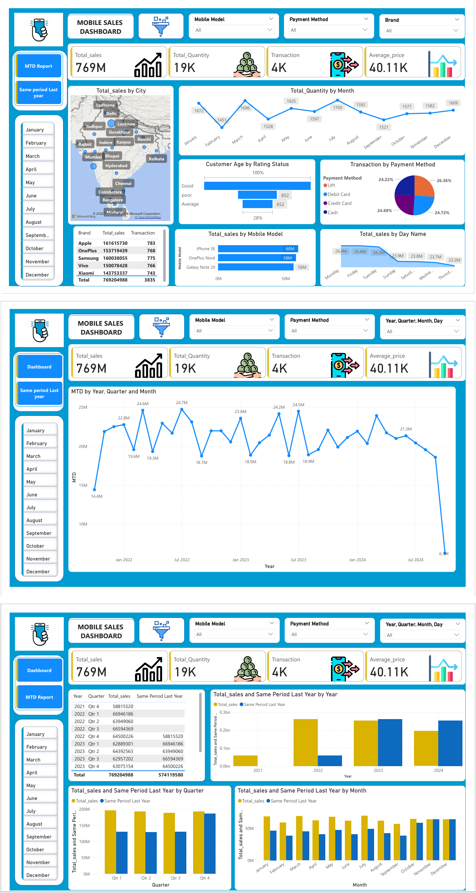

# MOBILE_SALSE-PROJECT
# Mobile Sales Dashboard

## Project Overview

An interactive Mobile Sales Dashboard built using Power BI to analyze sales performance, customer behavior, product performance, and business trends.

## Dashboard Preview

## Key Insights

* Total Sales, Quantity, Transactions, and Average Price
* Sales by Brand, City, and Mobile Model
* Monthly and yearly sales trends
* Customer Rating Analysis
* Payment Method Analysis
* Month-to-Date (MTD) Analysis
* Same Period Last Year comparison
* Interactive filters and slicers

## Tools & Technologies

* Power BI
* DAX
* Power Query
* Excel

## Skills

* Data Cleaning
* Data Transformation
* Data Modeling
* DAX & Time Intelligence
* Data Visualization
* Business Analysis
* Dashboard Design

## Objective

To analyze mobile sales data and build an interactive dashboard that provides meaningful business insights and helps understand sales trends, customer behavior, and product performance.
